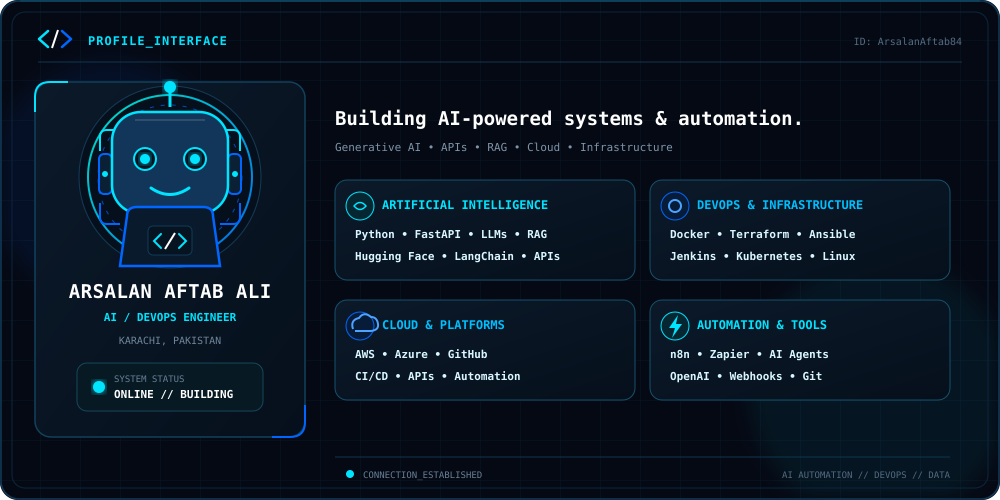

<picture>
  <source media="(prefers-color-scheme: dark)" srcset="https://raw.githubusercontent.com/ArsalanAftab84/ArsalanAftab84/output/github-contribution-grid-snake-dark.svg">
  <source media="(prefers-color-scheme: light)" srcset="https://raw.githubusercontent.com/ArsalanAftab84/ArsalanAftab84/output/github-contribution-grid-snake.svg">
  
</picture>

### 📊 GitHub Stats & Contributions

  

 

### 🛠️ Languages & Tools

**AI, LLMs & Analytics**

  
  
  
  
  

**DevOps & Cloud**

  
  
  
  

**Web Development & Platforms**

  
  
  

**Enterprise & Management Tools**

  
  

<!--
**ArsalanAftab84/ArsalanAftab84** is a ✨ _special_ ✨ repository because its `README.md` (this file) appears on your GitHub profile.

Here are some ideas to get you started:

- 🔭 I’m currently working on ...
- 🌱 I’m currently learning ...
- 👯 I’m looking to collaborate on ...
- 🤔 I’m looking for help with ...
- 💬 Ask me about ...
- 📫 How to reach me: ...
- 😄 Pronouns: ...
- ⚡ Fun fact: ...
-->
